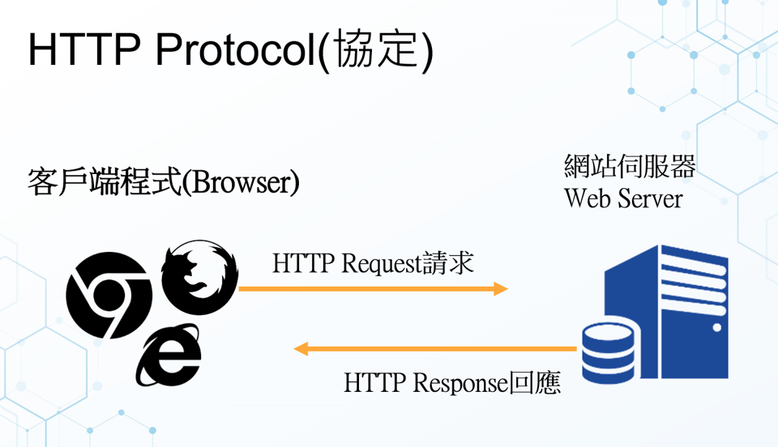

## 使用wireshark檢視出user使用的瀏覽器版本號 
- 示範題目:Network 101:PicoCTF_2017: Special Agent User(MUST)


## HTTP 協定



- HTTP `Request`(HTTP client[瀏覽器或其他工具如CURL] 送出的`請求`封包)
  - [請求方法(Request Methods):常見的有：GET ,POST, HEAD,OPTIONS,…](https://zh.wikipedia.org/wiki/超文本傳輸協議#請求方法)

- HTTP `Response` (伺服器`回應`封包)
  - Status Code(狀態碼)

## 題目分析
```
We can get into the Administrator's computer with a browser exploit.
But first, we need to figure out what browser they're using.
Perhaps this information is located in a network packet capture we took: data3.pcap.
Enter the browser and version as "BrowserName BrowserVersion".

NOTE: We're just looking for up to 3 levels of subversions for the browser version 
(ie. Version 1.2.3 for Version 1.2.3.4) and ignore any 0th subversions (ie. 1.2 for 1.2.0)

Hint:

Where can we find information on the browser in networking data?
Maybe try reading up on user-agent strings.
```
- [data3.pcap]()
- 1.題目要我們找瀏覽器版本號 `BrowserName BrowserVersion`
- 2.瀏覽器版本號在三個小數以上才是答案  looking for up to 3 levels of subversions for the browser version
- 題目暗示:
  - Where can we find information on the browser in networking data? Maybe try reading up on user-agent strings.
  - 在`user-agent`字串

## 解題步驟
- 步驟1:使用wireshark來開啟pcap檔
- 步驟2:在display filter 欄位中輸入http.request(請求)，只查看http 請求的封包
- 步驟3:選中一個封包 按右鍵 > Follow > TCP Stream
- 步驟4:逐項檢視所選的封包 即可找到答案


